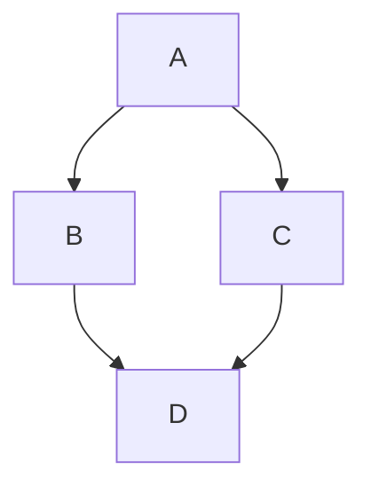

# Hugo Delphinus Theme

A Hugo theme based on Aarhus University's [Delphinus Design System](https://delphinus.au.dk/).

This repo has been branched out from: <https://github.com/riisendk/hugo-delphinus-template> which was the initial implementation of the theme. But it also had content in it so couldnt be used directly by others.

## Features

- Responsive layout with sidebar navigation
- Hierarchical documentation structure with collapsible sections
- Blog/posts section
- Client-side search via [Pagefind](https://pagefind.app/)
- Delphinus Design System CSS/JS loaded from CDN
- Accessible markup with skip-to-content and ARIA labels

## Installation

### As a Git Submodule

```bash
cd your-hugo-site
git submodule add https://github.com/AarhusUniversitet/hugo-delphinus-theme.git themes/delphinus
```

Then set in your `hugo.toml`:

```toml
theme = 'delphinus'
```

### Manual

Download or clone this repo into your site's `themes/delphinus` directory.

## Configuration

Add these parameters to your `hugo.toml`:

```toml
[params]
  description = "Your site description"
  footerSubtitle = "Documentation"
  organization = "Aarhus University"
  contactName = "John Doe"
  contactEmail = "example@example.com"
```

| Parameter | Description |
| ----------- | ------------- |
| `description` | Shown in the footer and in the HTML meta description |
| `footerSubtitle` | Text displayed next to the site title in the footer |
| `organization` | Organization name shown in the footer |
| `contactName` | Name of the contact person |
| `contactEmail` | Email address of the contact person |

## A fianl configuration example

```toml
baseURL = 'https://example.azurestaticapps.net/'
local = 'en-us'
title = 'My Site Title'
theme = 'delphinus'

[markup]
  [markup.goldmark]
    [markup.goldmark.renderer]
      unsafe = true

[params]
  description = "My site description"
  footerSubtitle = "My footer subtitle"
  organization = "Aarhus University"
  contactName = "John Doe"
  contactEmail = "example@example.com"
```

## Search (Pagefind)

After building your Hugo site, run Pagefind to index the content:

```bash
hugo --minify
npx pagefind --site public
```

## Mermaid Diagrams

This theme supports rendering Mermaid diagrams as described by [Guillaume A](https://blog.guillaumea.fr/post/adding-mermaid-diagrams-to-hugo-sites/). Include your Mermaid code blocks in your content files like this:



Set *mermaid: true* in the front matter of your content file to enable Mermaid diagrams.

Example front matter:

```yaml
---
title: "My Page"
mermaid: true
---
